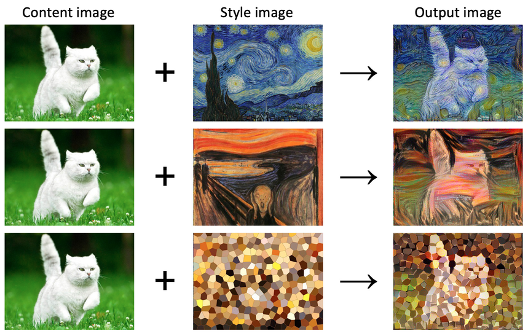
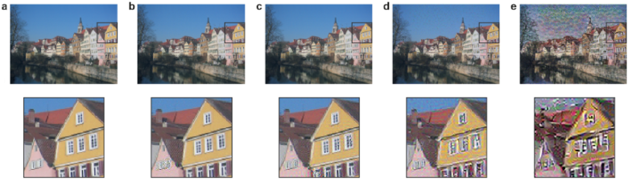

# style_transfer

This repository aims to provide tools to run style transfer on sets of images and allow parameter tuning in order to get various results.

## Introduction

Style transfer is a method where the style of an image is applied to the content of another image producing a new image that retains the structure of the content and the style of the artwork. Original approach was proposed by [Gatys et al. (2015)](https://arxiv.org/abs/1508.06576), where they used pretrained CNN (VGG) to extract features from images.



From a content image (preserve structure) and a style image (apply texture / style), it generates iteratively an image that minimizes the difference in structure from the content image and the difference in style from the style image. The CNN is already pretrained but no additional training is applied. Instead, images pass through a fixed CNN and feature maps from intermediate levels are used to capture different levels of abstraction.



Early layers (such as `a`) capture edges, corners or textures while deeper layers (such as `e`) capture objects and their arrangement within the input image. When reconstructing input image by comparing feature maps distance between original and generated image, deeper layers do not constrain the exact pixel values of the reconstruction, while preserving objects structure. In contrast, reconstructions from the early layers reproduce the pixel values of the original image. A deep layer is chosen for the content layer.

### Content loss

Content loss is computed by comparing features maps of the generated and content images at a deep layer.

Let $F^l_C$ and $F^l_G$ be the feature maps at layer $l$ for the **content image** and **generated image**.

$L_{content} = \frac{1}{2} \sum_{i,j} \left( F_{ij}^l(Generated) - F_{ij}^l(Content) \right)^2$

Where $i$ is the channel index and $j$ is the pixel index within a feature map.

Content loss is the squared euclidean distance between the feature maps of the content and generated images.

### Style loss

Style is represented using gram matrices of feature maps on style image and generated image. A gram matrix captures correlations between a set of feature maps.

Gram matrix is the inner product between the feature maps $F^l$ of size $[N_l × M_l]$ at layer $l$, where size $N_l$ is number of filters and $M_l$ is height × width.

$G_{ij}^l = \sum_{k=1}^{M_l} F_{ik}^l F_{jk}^l$

The style loss compares Gram matrices of the style and generated images.

$L_{style} = \sum_{l \in L} w_l \cdot \frac{1}{4 N_l^2 M_l^2} \sum_{i,j} \left( G_{ij}^l(Generated) - G_{ij}^l(Style) \right)^2$

Where $L$ is a list of layers used for style and $w_l$ is the weight assigned to each layer.

### Total loss

The total loss is a weighted sum of content and style loss that balance how much content vs style is preserved.

$L_{total} = \alpha \cdot L_{content} + \beta \cdot L_{style}$

Where $\alpha$ is the weight for content and $\beta$ is the weight for style.

### Optimization

During style transfer, the generated image is initialized from white noise or a copy or content image. Generated image is treated as a trainable parameter, its pixels are optimized with gradient descent. Generated is passed through the network and from generated image feature maps, losses are computed (by comparing generated, content and style feature maps). The image is then optimized until the end of the style transfer loop by minimizing the difference in content from the content image (content loss) and minimizing the difference in style from the style image (style loss).

## Installation

Clone project

```bash
git clone {project_url}
cd style_transfer/
```

Install CPU `environment_cpu.yml` or GPU `environment_gpu.yml` conda environment. Activate environment.

```bash
# cpu
conda env create -f environment_cpu.yml
conda activate style_transfer_cpu

# gpu
conda env create -f environment_gpu.yml
conda activate style_transfer_gpu
```

## Usage

Run an experiment.

```bash
python run_experiment.py -pc path/to/config/file.yml
```

Summarize an experiment. Copy all the generated images of different runs within a single summary directory.

```bash
python summarize_experiment.py -pe path/to/experiment/directory/
```
